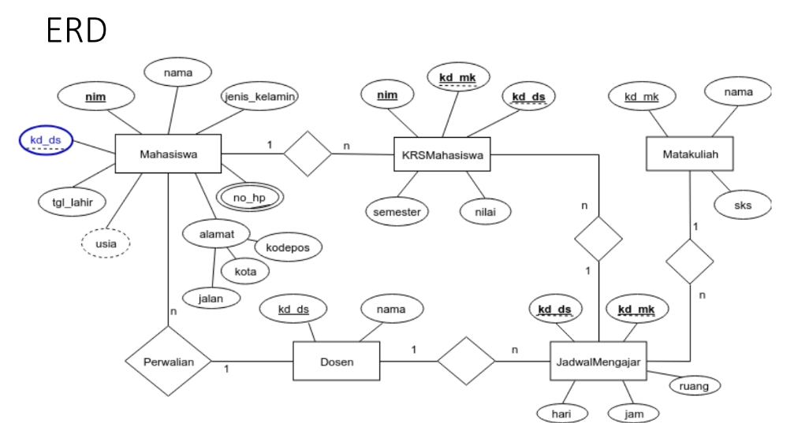

# PRAKTIKUM2_SQL

## DDL (Data Definition Language) & DML (Data Manipulation Language)


Transform ER-D ke dalam Mapping Table

* Data Model Mapping 
- Mahasiswa (nim, nama, jenis_kelamin, tgl_lahir, jalan, kota, kodepos, no_hp, kd_ds)
- Dosen (kd_ds, nama)
- Matakuliah (kd_mk, nama, sks)
- JadwalMengajar (kd_ds, kd_mk, hari, jam, ruang)
- KRSMahasiswa (nim, kd_mk, kd_ds, semester, nilai)

## Script DDL & DML

# DDL Script 
Data definition Language (DDL) adalah bahasa pemrogaraman yang digunakan untuk mengola objek database, seperti tabel, indeks, dan constraint. DDL digunakan untuk membuat, mengubah dan menghapus struktur database, termasuk tabel, kolom, kunci utama, indeks dan tampilan.
Berikut ini adalah perintah-perintah DDL yang digunakan untuk membuat sebuah DBMS berdasarkan skema ERD seperti pada gambar diatas.

* Membuat Database:
```sql
CREATE DATABASES praktikum2;
```

* Menggunakan Database:
```sql
USE praktikum2;
```

* Membuat Tabel Mahasiswa:
```sql
create table Mahasiswa (
    nim char(11) primary key, 
    nama varchar(50), 
    jenis_kelamin enum('Laki-laki', 'Perempuan'), tgl_lahir date, 
    jalan varchar(100), 
    kota varchar(50), 
    kodepos varchar(10), 
    no_hp varchar(15), 
    kd_ds char(10), 
    foreign key (kd_ds) references Dosen(kd_ds)
    );
```

* Membuat Tabel Dosen :
```sql
create table Dosen (
    kd_ds char(10) primary key, 
    nama varchar(50)
    );
```

* Membuat Tabel Matakuliah:
```sql
create table MataKuliah (
    kd_mk char(10) primary key, 
    nama varchar(50), sks int);
```

* Membuat Tabel Jadwal Mengajar:
```sql
create table JadwalMengajar (
    kd_ds char(10), 
    kd_mk char(10), 
    hari enum('senin', 'selasa', 'rabu', 'kamis', 'jumat', 'sabtu', 'minggu'), 
    jam time, 
    ruang varchar(10), 
    primary key (kd_ds, kd_mk), 
    foreign key (kd_ds) references Dosen(kd_ds), foreign key (kd_mk) references MataKulia (kd_mk));
```

* Membuat Tabel KRS Mahasiswa:
```sql
create table KRSMahasiswa (
    nim char(10), 
    kd_mk char(5), 
    kd_ds char(10), 
    semester int, 
    nilai decimal(5, 2), 
    primary key (nim, kd_mk), 
    foreign key (nim) references Mahasiswa(nim), foreign key(kd_mk) references MataKuliah(kd_mk), foreign key (kd_ds) references Dosen(kd_ds));
```

# DML Script
Data Manipulation Language (DML) adalah bahasa yang digunakan untuk mengakses, memanipulasi, dan mengubah data dalam database.
Berikut ini adalah perinta-perintah DDL yang digunakan untuk membuat sebuah DBMS berdasarkan skema ERD seperti pada gambar diatas.

* Menambah Data:
```sql
insert into Mahasiswa (nim, nama, jenis_kelamin, tgl_lahir, jalan, kota, kodepos, no_hp, kd_ds)
    -> value ('11223344', 'Ari Santoso', 'Laki-laki', '1998-10-12', NULL, 'Bekasi', NULL, NULL, NULL),
    ->        ('11223345', 'Ario Talib', 'Laki-laki', '1999-11-16', NULL, 'Cikarang', NULL, NULL, NULL),
    ->        ('11223346', 'Dina Marlina', 'Perempuan', '1997-12-01', NULL, 'Karawang', NULL, NULL, NULL),
    ->        ('11223347', 'Lisa Ayu', 'Perempuan', '1996-01-02', NULL, 'Bekasi', NULL, NULL, NULL),
    ->        ('11223348', 'Tiara Wahidah', 'Perempuan', '1908-02-05', NULL, 'Bekasi', NULL, NULL, NULL),
    ->        ('11223349', 'Anton Sinaga', 'Laki-laki', '1988-03-10', NULL, 'Cikarang', NULL, NULL, NULL);
```

* Mengubah Data:
```sql
update Mahasiswa set tgl_lahir='1979-08-31' where nim='11223344';
```

* Menghapus Data:
```sql
delete from Mahasiswa where nim='11223346';
```

* Menampilkan Data:
```sql
select * from Mahasiswa;
```

* Menampilkan Data Sesuai Kondisi:
```sql
select * from Mahasiswa where tgl_lahir>='1996-01-02';
```
```sql
select * from Mahasiswa where kota='Bekasi' and jenis_kelamin='Perempuan';
```

* Menampilkan Data Sesuai Urutan:
```sql
select * from Mahasiswa order by nama asc;
```

## Evaluasi Dan Pertanyaan

* Apa bedanya penggunaan BETWEEN dan penggunaan operator >= dan <=?

Penggunaan BETWEEN pada sintaks pertama menentukan dua nilai batas, dalam hal ini '1990-10-10' AND '1992-10-11', AND memeriksa apakah nilai pada kkolom tgl_lahir berada di antara kedua nilai tersebut, termasuk kedua nilai batas. Sedangkan pada sintaks kedua, penggunaan operator >= dan <= memeriksa apakah nilai pada kolom tgl_lahir lebih besar dari atau sama dengan '1990-10-10' dan kurang dari atau sama dengan '1992-10-11'.

* Berikan Kesimpulan Anda

Kedua sintaks tersebut dapat digunakan untuk mengambil sebuah data rentang nilai tertentu dari kolom tanggal lahir pada sebuah tabel. Namun, dalam penggunaannya tergantung pada preferensi pengguna dan persyaratan atau standar yang diterapkan pada pengolahan data di suatu database.